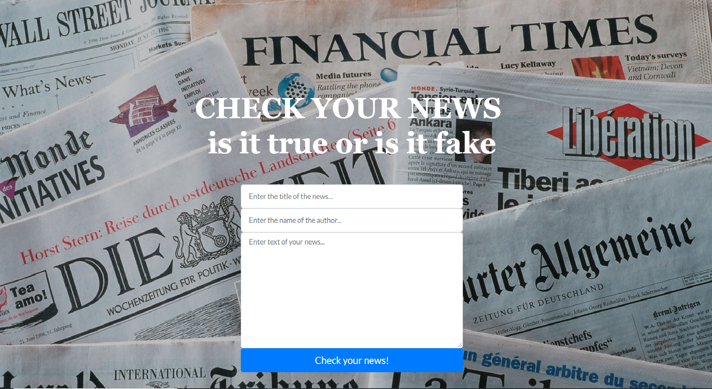
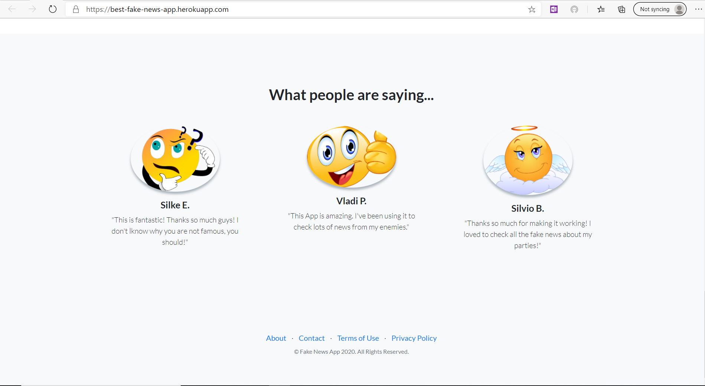

# Webb App for classification of fake and true news.
 

This is my second end-to-end Machine Learning project using django and deployment on heroku with AWS S3.
There is a part of data manipulation, cleaning and exploratory analysis as well. Data can be find here: https://www.kaggle.com/c/fake-news/data

**Web App: https://best-fake-news-app.herokuapp.com**

