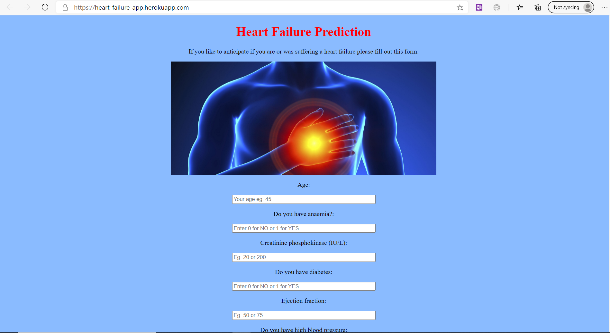

# Webb App for prediciton of heart failure

This is my first end-to-end Machine Learning project using django and deployment on heroku.
There is a part of data manipulation, cleaning and exploratory analysis as well. Data is well known and can be find here: https://www.kaggle.com/andrewmvd/heart-failure-clinical-data

**Web App: https://heart-failure-app.herokuapp.com**

